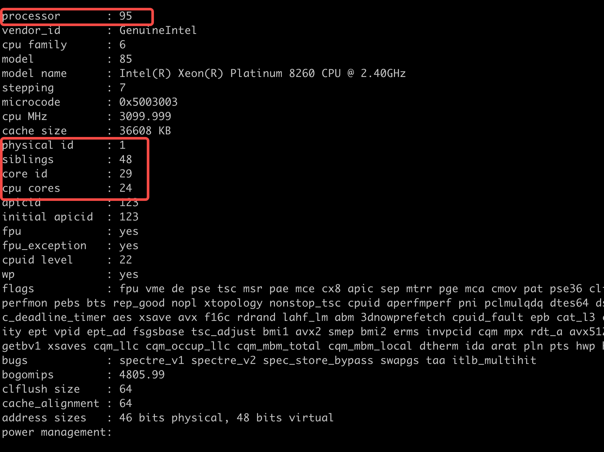
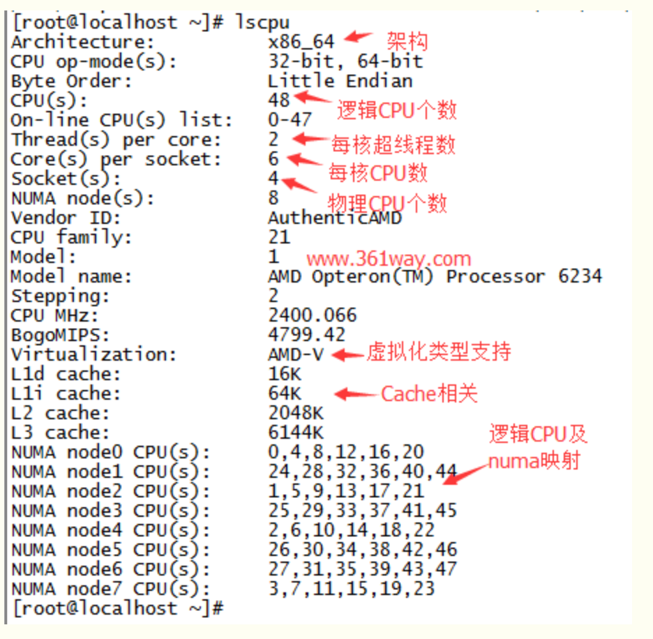

# 超线程 vs 多核心 vs 多cpu

- [超超线程/双核/双路CPU三者的区别](https://blog.csdn.net/whchenfei/article/details/4708466?utm_medium=distribute.pc_relevant.none-task-blog-2~default~baidujs_baidulandingword~default-0-4708466-blog-105027718.pc_relevant_aa&spm=1001.2101.3001.4242.1&utm_relevant_index=3)

- [CPU工作方式、多核心、超线程技术详解](https://zhuanlan.zhihu.com/p/52112475)

### `/proc/cpuinfo` 详解
①物理CPU数（physical id）：主板上实际插入的cpu数量，可以数不重复的 physical id 有几个

②CPU核心数（cpu cores）：单块CPU上面能处理数据的芯片组的数量，如双核、四核等 

③逻辑CPU数：一般情况下，
```shell
逻辑CPU=物理CPU个数×每颗核数     　　#不支持超线程技术或没有开启次技术

逻辑CPU=物理CPU个数×每颗核数 *2  　  #表示服务器的CPU支持超线程技术（简单来说，它可使处理器中的1 颗内核如2 颗内核那样在操作系统中发挥作用。这样一来，操作系统可使用的执行资源扩大了一倍，大幅提高了系统的整体性能）
```

```
processor: 系统中逻辑处理核心数的编号，从0开始排序

physical id: 单个物理CPU的标号

siblings: 单个物理CPU的逻辑CPU数, siblings=cpu cores [*2]

core id ：当前物理核在其所处CPU中的编号，这个编号不一定连续

cpu cores ：该逻辑核所处CPU的物理核数。比如此处cpu cores 是4个，那么对应core id 可能是 1、3、4、5
```

[/proc/cpuinfo文件解读（超易理解）](https://www.cnblogs.com/wxxjianchi/p/10522049.html)

### `lscpu`详解


`lscpu`从`sysfs`和`/proc/cpuinfo`收集cpu体系结构信息，命令的输出比较易读。

补充几个概念：

* processor 条目包括这一逻辑处理器的唯一标识符。    
* physical id 条目包括每个物理封装的唯一标识符。   
* core id 条目保存每个内核的唯一标识符。    
* siblings 条目列出了位于相同物理封装中的逻辑处理器的数量。    
* cpu cores 条目包含位于相同物理封装中的内核数量。    
* 如果处理器为英特尔处理器，则 vendor id 条目中的字符串是 GenuineIntel。

socket：物理CPU的插槽     
Core per Socket：每一个插槽对应的物理CPU上有多少个核     
Thread per Core：每个核上有多少个线程 

[lscpu命令详解](https://www.cnblogs.com/machangwei-8/p/10398902.html)
