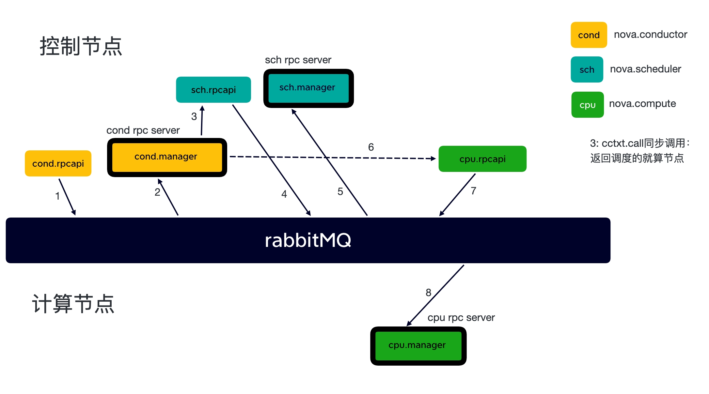
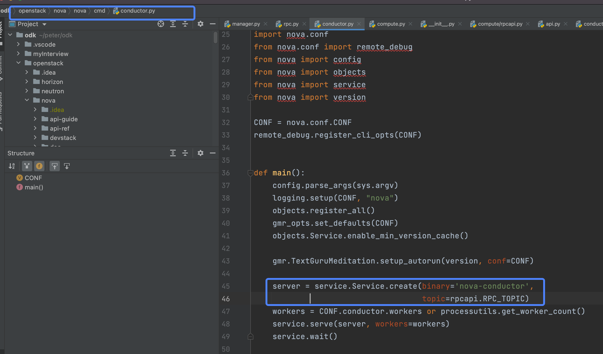
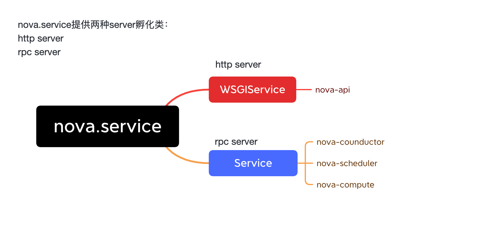
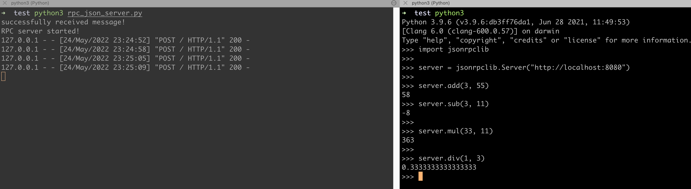

# 理解openstack当中的rpc远程调用(一)



以nova为例，上图展示了创建实例的时候，nova内部个子组件借用rpc相互配合，完成实例创建的流程。
其中，`conductor.rpcapi`调用相同目录下的`conductor.manager`， 前者作为rpc client，后者作为rpc server。

> conductor.rpcapi -> rpc client    
> conductor.manger -> rpc server

各个子组件（出了nova-api）的rpc server通过`oslo.service`来库初始化和启动，以nova-conductor的rpc server
启动文件为例：


```python
server = service.Service.create(binary='nova-conductor',
                                    topic=rpcapi.RPC_TOPIC)
```

在 `nova.service`下，一共有两种server类：
- `WSGIService(service.Service)`
- `Service(service.Service)`

其中`WSGIService`用来孵化`nova-api`服务，**作为接口层**对外提供RESTful API。
`Service`则孵化nova剩下的子组件的rpc server。


其中，rpc server中的各种`endpoints`就是对应的各个子服务的manager：
> conductor: nova.conductor.manager.ConductorManager    
> scheduler: nova.scheduler.manager.SchedulerManager    
> compute: nova.compute.manager.ComputeManager  

## 一、RPC和REST

百度百科给出的解释是这样的：“RPC（Remote Procedure Call Protocol）——远程过程调用协议，
它是一种通过网络从远程计算机程序上请求服务，而不需要了解底层网络技术的协议”。

REST，是Representational State Transfer 的简写，
中文描述表述性状态传递（是指某个瞬间状态的资源数据的快照，包括资源数据的内容、表述格式(XML、JSON)等信息。）

### 1.1 rpc和rest区别

#### 1). 所属类别不同
REST 是一种软件架构风格。 这种风格的典型应用，就是HTTP。其因为简单、扩展性强的特点而广受开发者的青睐。
RPC顾名思义，它可以实现客户端像调用本地服务(方法)一样调用服务器的服务(方法)。
RPC 是一种基于 TCP(也可以直接基于HTTP) 的通信协议，按理说它和REST不是一个层面上的东西，
不应该放在一起讨论，但是谁让REST这么流行呢，它是目前最流行的一套互联网应用程序的API设计标准，
某种意义下，我们说 REST 可以其实就是指代 HTTP 协议。

#### 2). 使用方式不同

**从使用上来看**，HTTP 接口只关注服务提供方，对于客户端怎么调用并不关心。
接口只要保证有客户端调用时，返回对应的数据就行了。而RPC则要求客户端接口保持和服务端的一致。

* REST 是服务端把方法写好，客户端并不知道具体方法。客户端只想获取资源，所以发起HTTP请求，
  而服务端接收到请求后根据URI经过一系列的路由才定位到方法上面去。
  
* RPC是服务端提供好方法给客户端调用，客户端需要知道服务端的具体类，具体方法，然后像调用本地方法一样直接调用它。

#### 3). 面向对象不同

* RPC，是面向方法的
* REST是面向资源的
  
除此之外，还有一种叫做 SOA，所谓的面向服务的架构，它是面向消息的，这个接触不多，就不多说了。

#### 4). 序列化协议不同
接口调用通常包含两个部分，`序列化`和`通信协议`。

* REST 是 基于 HTTP 协议
* RPC 可以基于 TCP/UDP，也可以基于 HTTP 协议进行传输的。

常见的序列化协议，有：json、xml、hession、protobuf、thrift、text、bytes等。

* REST 通常使用的是 JSON或者XML
* RPC 使用的是 JSON-RPC，或者 XML-RPC

### 1.2 为什么使用rpc

* RPC 和 REST 两者的定位不同，REST 面向资源，更注重接口的规范，
  因为要保证通用性更强，所以对外最好通过 REST。而 RPC 面向方法，主要用于函数方法的调用，
  可以适合更复杂通信需求的场景。
* RESTful API客户端与服务端之间采用的是同步机制，当发送HTTP请求时，
  客户端需要等待服务端的响应。当然对于这一点是可以通过一些技术来实现异步的机制的。
* 采用RESTful API，客户端与服务端之间虽然可以独立开发，但还是存在耦合。比如，客户端在发送请求的时，
  必须知道服务器的地址，且必须保证服务器正常工作。而 rpc + rabbitmq中间件可以实现低耦合的分布式集群架构。
  
何时选择rpc？

* REST 接口更加规范，通用适配性要求高，建议对外的接口都统一成 REST。而组件内部的各个模块，
  可以选择 RPC，一个是不用耗费太多精力去开发和维护多套的HTTP接口，一个RPC的调用性能更高。
  
* 从性能角度看，由于HTTP本身提供了丰富的状态功能与扩展功能，但也正由于HTTP提供的功能过多，导致在网络传输时，
  需要携带的信息更多，从性能角度上讲，较为低效。而RPC服务网络传输上仅传输与业务内容相关的数据，
  传输数据更小，性能更高。
  
## 实现rpc的几种方式
### 基于json-rpc
`SimpleJSONRPCServer` 是基于`json-rpc`序列化协议实现的rpc，很多web框架其自身都自己实现了json-rpc。
<details> 
<summary><font size="5" color="orange">rpc server</font></summary>

```python
from jsonrpclib.SimpleJSONRPCServer import SimpleJSONRPCServer

class cal(object):
    
    print("successfully received message!")
    add = lambda self, x, y: x + y
    sub = lambda self, x, y: x - y
    div = lambda self, x, y: x / y
    mul = lambda self, x, y: x * y

obj = cal()
server = SimpleJSONRPCServer(('localhost', 8080))
server.register_instance(obj)
print("RPC server started!")
server.serve_forever()
```

</details>

调用结果：


### 基于xml-rpc
跟基于`json-rpc`类似，使用`xml-rpc`序列化协议，此处略过。

### 基于zerorpc
以上两种rpc都是基于http通信协议实现的，而zerorpc则是直接通过http协议的。   
[zerorpc](https://github.com/0rpc/zerorpc-python)
这个第三方库，它是基于TCP协议、 ZeroMQ 和 MessagePack的，速度相对快，响应时间短，并发高

<details> 
<summary><font size="5" color="orange">zerorpc server</font></summary>

```python
import zerorpc

class cal(object):

    echo = lambda self, name: "Nice to meet you, %s" % name
    add = lambda self, x, y: int(x) + int(y)
    sub = lambda self, x, y: int(x) - int(y)
    div = lambda self, x, y: int(x) / int(y)
    mul = lambda self, x, y: int(x) * int(y)

s = zerorpc.Server(cal())
s.bind("tcp://0.0.0.0:4242")
print("Zerorpc started...")
s.run()
```
</details>

客户端调用：
```python
>>> import zerorpc
>>> c = zerorpc.Client()
>>> c.connect("tcp://127.0.0.1:4242")
[<SocketContext(connect='tcp://127.0.0.1:4242')>]
>>> c.echo("zzw")
'Nice to meet you, zzw'
>>> c.add(3, 2)
5
>>> c.mul(11, 22)
242
```
zerorpc也可以通过命令行调用：
```shell
➜  test zerorpc tcp://localhost:4242 echo zzw
connecting to "tcp://localhost:4242"
'Nice to meet you, zzw'
➜  test zerorpc tcp://localhost:4242 add 11 33
connecting to "tcp://localhost:4242"
44
➜  test zerorpc tcp://localhost:4242 sub 3 11
connecting to "tcp://localhost:4242"
-8
➜  test zerorpc tcp://localhost:4242 mul 11 22
connecting to "tcp://localhost:4242"
242
➜  test zerorpc tcp://localhost:4242 div 1 3
connecting to "tcp://localhost:4242"
0.3333333333333333
```

同样的，zerorpc server也可以通过命令行启动，不在赘述。


