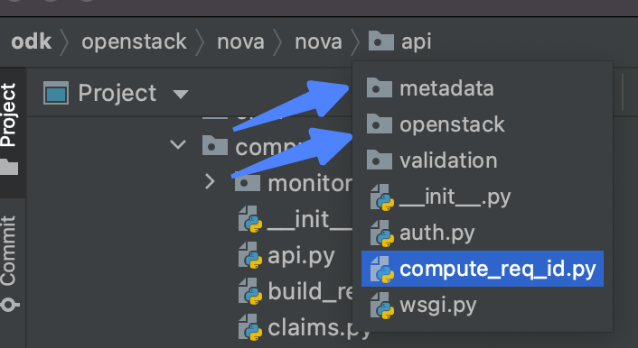
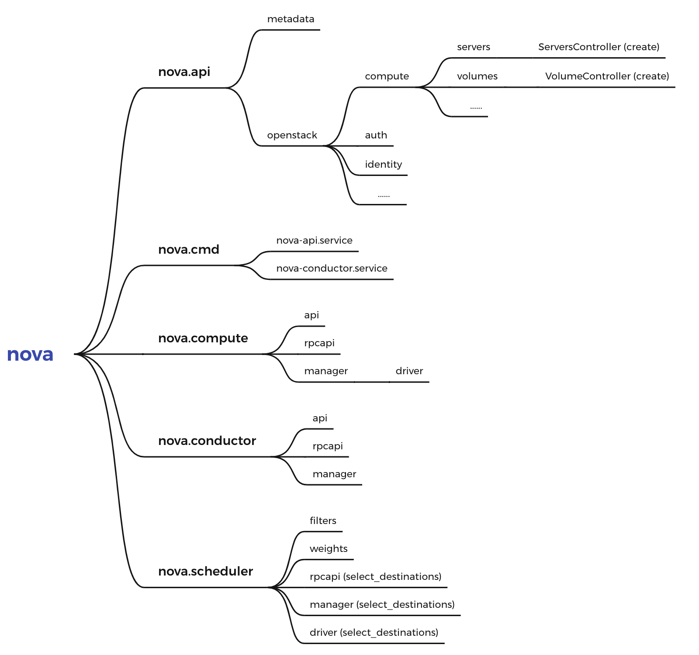

参考： [OpenStack源码阅读－创建虚拟机（三）](https://blog.csdn.net/LL_JCB/article/details/80287338)

先来搞清楚V版本openstack nova中api的目录结构：

前面我们已经知道了api有两种，`WSGIServer`线程池监听的api包括两种：     `osapi_compute`和`metadata`。 
分别对应上面的`nova.api.metadata`和`nova.api.openstack`。

整个nova代码的结构目录可以参考如下图：

