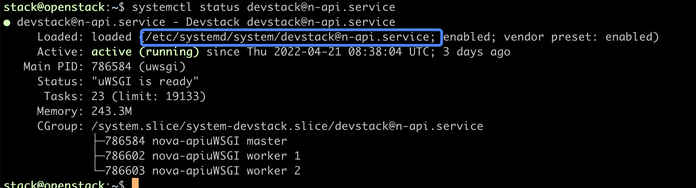
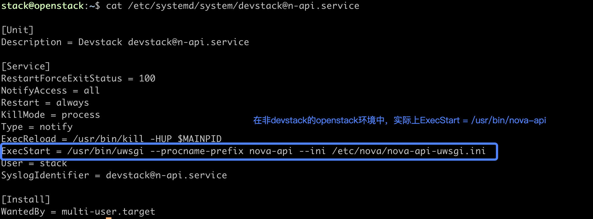
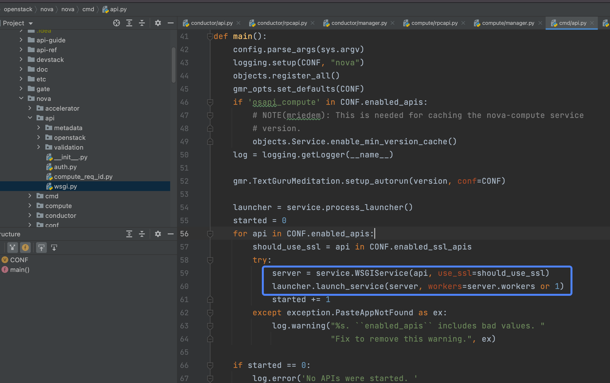
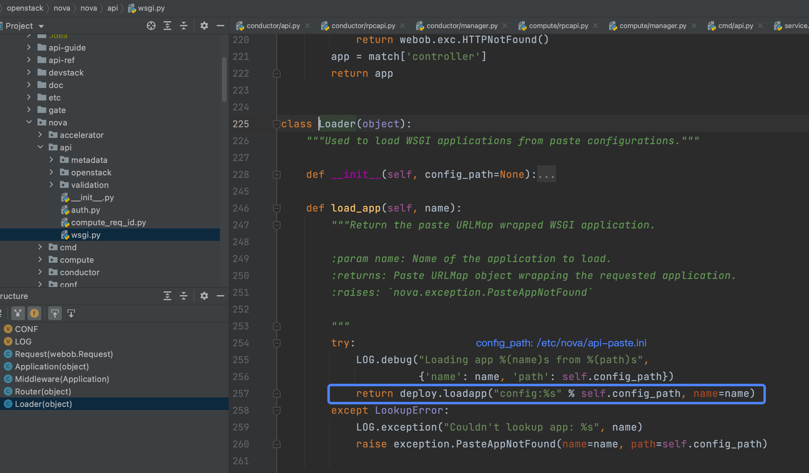

参考：         
[OpenStack源码阅读－创建虚拟机（二）](https://blog.csdn.net/LL_JCB/article/details/80287329)     
[花了两个星期，我终于把 WSGI 整明白了](https://mp.weixin.qq.com/s?__biz=MzIzMzMzOTI3Nw==&mid=2247484919&idx=1&sn=bd7d2bc0ab8a41110d5d93e44ad20b1f&source=41#wechat_redirect)

前面说到，创建虚拟机的请求发送出去了，这个请求实际是发送给**nova-api**服务的，查看`nova-api`服务的配置文件：



在服务配置文件中，找到服务的启动配置文件：



在非devstack环境的openstack中，`nova-api`服务的启动脚本应该是`/usr/bin/nova-api`,
其内容如下：
```shell
#!/usr/bin/python2
# PBR Generated from u'console_scripts'
import sys
from nova.cmd.api import main

if __name__ == "__main__":
    sys.exit(main())
```



> 调用： nova.api.WSGIService -> nova.service.WSGIService

`main`函数中启动了一个`WSGIService`服务器(wsgi server线程池)，其中`api`包括两种：     `osapi_compute`和`metadata`。 

```python
# 路径1: nova.service.WSGIService
from oslo_service import service
from nova import wsgi

...

class WSGIService(service.Service):
    
    def __init__(self, name, loader=None, use_ssl=False, max_url_len=None):
        ...
        self.loader = loader or api_wsgi.Loader()
        self.app = self.loader.load_app(name)
        ...
        # 实际上 self.server是一个evenlet线程池
        self.server = wsgi.Server(name,
                                  self.app,
                                  host=self.host,
                                  port=self.port,
                                  use_ssl=self.use_ssl,
                                  max_url_len=max_url_len)

# 路径2：nova.wsig.Server

class Server(service.ServiceBase):
    
    # pool的默认大小为1000
    default_pool_size = CONF.wsgi.default_pool_size

    def __init__(self, name, app, ...):
        ...
        self.app = app
        # 起一个默认大小为1000的线程池
        self.pool_size = pool_size or self.default_pool_size
        self._pool = eventlet.GreenPool(self.pool_size)
        ...
        # eventlet异步socket监听
        self._socket = eventlet.listen(bind_addr, family, backlog=backlog)
        ...

    def start(self):
        ...
        # socket监听
        dup_socket = self._socket.dup()
        ...
        wsgi_kwargs = {
            'func': eventlet.wsgi.server,
            'sock': dup_socket,
            'site': self.app,
            'protocol': self._protocol,
            'custom_pool': self._pool,
            'log': self._logger,
            'log_format': CONF.wsgi.wsgi_log_format,
            'debug': False,
            'keepalive': CONF.wsgi.keep_alive,
            'socket_timeout': self.client_socket_timeout
            }

        if self._max_url_len:
            wsgi_kwargs['url_length_limit'] = self._max_url_len

        self._server = utils.spawn(**wsgi_kwargs)

```
> 调用： nova.service.WSGIService -> nova.wsgi.Server

可以看到，从 `nova.api` -> `nova.services` -> `nova.wsgi`，启动了一个默认大小为1000的`eventlet pool`，
注意看，路径1中的`self.app`。        
`self.app`通过`self.loader.load_app(name)`load而来，name就是前面提到的`api`，包括两种： `osapi_compute`和`metadata`。
默认情况下：      
```python
from nova.api import wsgi as api_wsgi
...
self.loader = api_wsgi.Loader()
```     

追踪`nova.api.wsgi.Loader()`:     


从上面内容来看，我们已经知道`WSGIService`使用`self.loader.load_app(name)`来加载wsgi app，加载app完成之后，使用`nova.wsgi.Server`来发布服务。
`wsgi.Server`会将监听到的http请求交给app处理。

上面加载了`osapi_compute`，wsgi server接收到的http请求首先会交给`nova.api.openstack.urlmap:urlmap_factory`的可调用对象，
处理之后将请求分发给`openstack_compute_api_v21`，`openstack_compute_api_v21`使用`nova.api.auth:pipeline_factory_v21`来返回wsgi app，
`pipeline_factory_v21`会依次加载`cors` `http_proxy_to_wsgi compute_req_id` `faultwrap` `request_log` `sizelimit` `osprofiler` 
`authtoken` `keystonecontext`这些filter（这些filter就是wsgi middleware），这些filter处理完成之后才会将请求交给`osapi_compute_app_v21`
（相当于wsgi app）。


`api-paste.ini`文件： 
```shell
[composite:osapi_compute]
use = call:nova.api.openstack.urlmap:urlmap_factory
...
/v2.1: openstack_compute_api_v21

[composite:openstack_compute_api_v21]
use = call:nova.api.auth:pipeline_factory_v21

...
keystone = keystone = cors http_proxy_to_wsgi compute_req_id faultwrap request_log sizelimit osprofiler authtoken keystonecontext osapi_compute_app_v21

...
[filter:sizelimit]
paste.filter_factory = oslo_middleware:RequestBodySizeLimiter.factory 

[app:osapi_compute_app_v21]
paste.app_factory = nova.api.openstack.compute:APIRouterV21.factory
...
```
注意这里，通过中间件`authtoken`对请求中的token进行验证：      
```shell
[filter:authtoken]
paste.filter_factory = keystonemiddleware.auth_token:filter_factory
```
更过token的验证过程，参考 [keystonemiddleware中的token 认证](https://blog.csdn.net/cengjch2011/article/details/49468269)

```python
#路径3： nova.api.openstack.compute.routes.APIRouterV21
from nova import wsgi as base_wsgi
from nova.api.openstack.compute import servers
...
server_controller = functools.partial(_create_controller,
    servers.ServersController
...

ROUTE_LIST= (... 
('/servers', {
        'GET': [server_controller, 'index'],
        'POST': [server_controller, 'create']
    }),...)

class APIRouterV21(base_wsgi.Router):
    def __init__(self, custom_routes=None):
        super(APIRouterV21, self).__init__(nova.api.openstack.ProjectMapper())
        ...
        for path, methods in ROUTE_LIST + custom_routes:
            ...
            for method, controller_info in methods.items():
                controller = controller_info[0]()
                action = controller_info[1]
                self.map.create_route(path, method, controller, action)
    
    @classmethod
    def factory(cls, global_config, **local_config):
        return cls()

#路径4：nova.api.wsgi.Router

class Router(object):
    ...
    def __init__(self, mapper):
        self.map = mapper
        self._router = routes.middleware.RoutesMiddleware(self._dispatch,
                                                          self.map)

    def __call__(self, req):
        return self._router

    def _dispatch(req):
        match = req.environ['wsgiorg.routing_args'][1]
        if not match:
            return webob.exc.HTTPNotFound()
        app = match['controller']
        return app
```

直接看`osapi_compute_app_v21`这边如何处理请求的。        
根据上面配置文件信息，我们知道调用了`nova.api.openstack.compute.APIRouterV21.factory`的可调用对象。这个`factory`实际就在下面路径3所示，
它应该返回一个可调用对象。这里可以看到它返回的是类对象，而`APIRouterV21继承的是base_wsgi.Router`，也就是说请求是调用了路径4中的`call`方法。

而`call`方法返回的是`self._router，_router`是`routes.middleware.RoutesMiddleware`的实例化对象，
使用`self._dispatch和self.map`来初始化的。`self.map`是哪传进来的呢？

注意看路径3中的`APIRouterV21的init`方法，其中传入了一个`nova.api.openstack.ProjectMapper()`对象，而这个`ProjectMapper`
最终继承的是`routes.Mapper，routes.Mapper`。它是一个路由模块，所以路径4中的`self.map`已经明了是一个`routes.Mapper()`对象，
并且通过路径3中的`APIRouterV21`的`init`方法建立了映射关系，nova api在启动的时候已经初始化并建立url与资源的映射关系。

继续看路径4中的`dispatch`方法，它通过前面设置`environ[‘wsgiorg.routing_args’]`来找到url对应的controller，找不到返回404。
根据路径3的`ROUTE_LIST`信息，可以看到`/servers`对应的controller是`nova.api.openstack.compute.servers`中的`ServersController`。

最后看看`ServerController`，找到了`post`对应的方法`create`。也就是说nova客户端发送的请求最后是调用到了操作函数`create`。

```python
#路径5： nova.api.openstack.compute.servers.ServersController

class ServersController(wsgi.Controller):
    ...
    def create(self, req, body):
        ...
        (instances, resv_id) = self.compute_api.create(...)
        ...
        return wsgi.ResponseObject(...)
```
